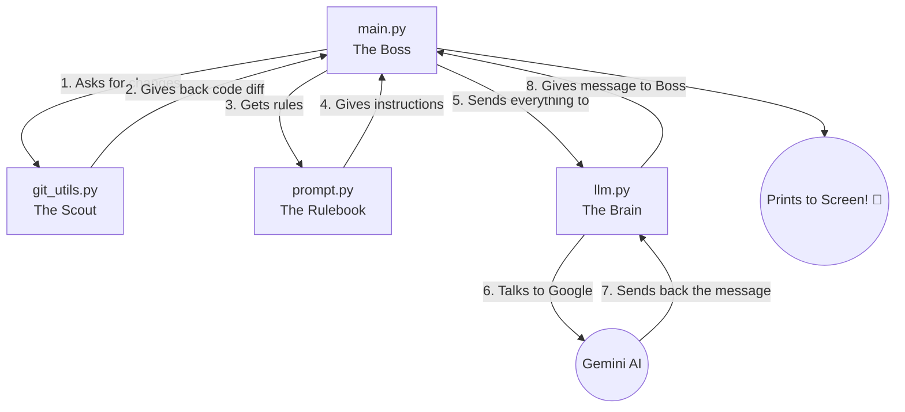

# 🤖 AI Commit Message Generator

Imagine you just built a super cool LEGO spaceship (your code). Now you want to put it on a shelf, but you need to write a little sticky note explaining exactly what you changed so you remember it later. 

Instead of writing that note yourself, you just ask a super smart robot to look at your LEGO pieces and write the note for you! 

That's exactly what this project does! It looks at the code you changed and automatically writes a perfect "Git Commit Message" (the sticky note) using Google's AI.

---

## 📖 How it Works (The Magic Flow)

1. **You make changes** to your code (add a new file, fix a bug).
2. **You tell Git to get ready** to save them (`git add`).
3. **You run our script** (`python main.py`).
4. **The AI robot looks** at what you changed, thinks for a second, and spits out a beautiful summary of your work!

### 🗺️ The Architecture Map (How the files talk to each other)

Here is a map of what happens inside the code when you press run:



**What each file does:**
- `main.py` is the **Boss**. It wakes up first and tells everyone else what to do.
- `git_utils.py` is the **Scout**. The Boss sends it to check what code you just changed. 
- `prompt.py` is the **Rulebook**. It tells the AI exactly how to write the sticky note.
- `llm.py` is the **Brain**. It takes the code and the rules, securely calls Google's Gemini AI, and brings the final message back to the Boss.

---

## 🛠️ What You Need to Run This

- **Python** installed on your computer.
- A **Gemini API Key** (this is like a VIP pass to talk to Google's AI).

---

## 🚀 How to Install and Start Playing!

**Step 1: Get the code**
Download this folder to your computer.

**Step 2: Install the Robot Brain (Dependencies)**
Open your terminal inside this folder and run:
```bash
pip install -r requirements.txt
```

**Step 3: Give the Robot its VIP Pass**
1. Create a file named `.env` in this folder.
2. Open it and paste your Google Gemini API Key inside like this:
```text
GEMINI_API_KEY=your_super_secret_key_here
```

**Step 4: Test it out!**
Change some code in any file, stage it, and ask the AI for a message:
```bash
git add .
python main.py
```

*Boom!* You'll see a perfect, professional commit message pop up on your screen! 
